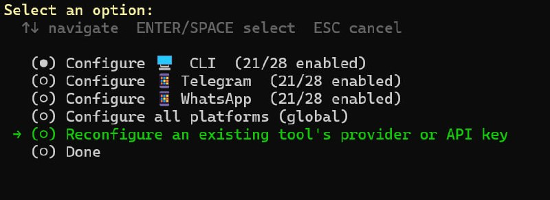
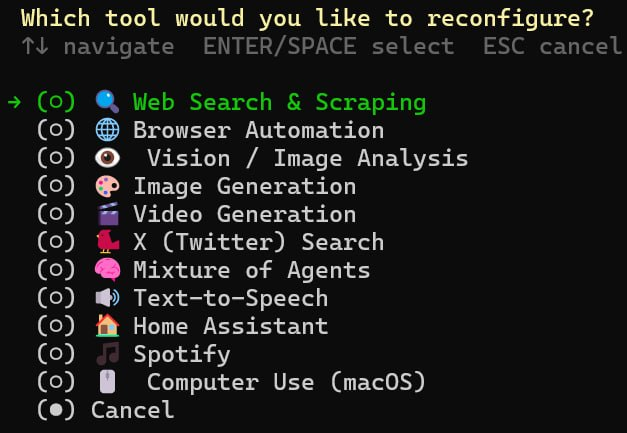
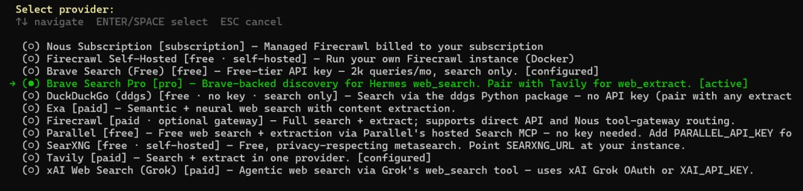
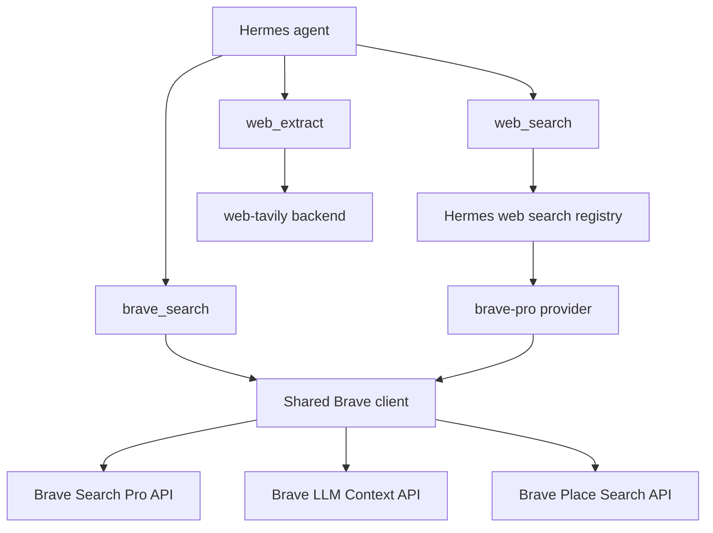

# Brave Search Pro for Hermes Agent

<p align="center">
  
</p>

<p align="center">
  
</p>

<p align="center">
  <a href="LICENSE"></a>
  
  
  
</p>

Brave Search Pro as a first-class Hermes Agent plugin.

Brave handles fast, index-backed discovery for `web_search`, and the explicit `brave_search` tool adds Brave-specific modes plus dedicated Brave LLM Context API chunks and Brave Place Search API support when you want richer agent context. Tavily-backed `web_extract` remains a separate optional Hermes plugin pairing.

## Why this exists

Hermes already separates search from extraction. This plugin leans into that design:

- **Discovery:** `web_search` uses Brave Search Pro through the `brave-pro` backend.
- **Extraction:** `web_extract` can stay on Tavily when Hermes' bundled `web-tavily` plugin is enabled and `web.extract_backend` is set to `tavily`.
- **Query context:** `brave_search(mode="llm")` and `brave_search(mode="context")` call Brave's dedicated `/res/v1/llm/context` endpoint.
- **Place search:** `brave_search(mode="place")` and `brave_search(mode="local")` call Brave's `/res/v1/local/place_search` endpoint, with follow-up POI detail modes for `/pois` and `/descriptions`.
- **Advanced search:** `brave_search` exposes Brave modes that do not fit the standard `web_search` contract.
- **No source patching:** install the plugin, let its compatibility shim configure safe defaults, and keep updating Hermes normally.

## Features

- Hermes web-search provider named `brave-pro`
- Runtime compatibility shim that safely prefers Brave Pro over Brave Free when both share the same Brave API key
- Advanced Hermes tool named `brave_search`
- Dedicated Brave LLM Context API support for query-to-context chunks
- Context controls for freshness, country, language, Goggles, local recall, source metadata, snippets, and token budgets
- Brave Place Search API modes for places, local Explore Mode, POI details, and POI descriptions
- Bounded retry handling for transient Brave API failures
- Search-only provider so extraction stays on a dedicated backend such as Hermes' bundled `web-tavily`
- Shared Brave client with structured errors and response normalisation
- Mocked test suite that does not require live Brave credentials
- Public-ready docs, examples, and visual explanation

## Quick start

Canonical Hermes install:

```bash
hermes plugins install GodsBoy/hermes-brave-search-pro --enable
```

During install, Hermes prompts for the plugin's required credential:

- `BRAVE_SEARCH_API_KEY` for Brave-backed search

If you skipped the prompt, export it in the environment Hermes runs with:

```bash
export BRAVE_SEARCH_API_KEY=bsa-your-key-here
```

Brave Search Pro is search-only by design, so this plugin does not provide `web_extract`. If you want Tavily-backed extraction, enable Hermes' bundled Tavily plugin separately, add `TAVILY_API_KEY`, and point extraction at Tavily:

```bash
hermes plugins enable web-tavily
hermes config set web.extract_backend tavily
```

Tavily has a free tier, see [app.tavily.com](https://app.tavily.com/). When Hermes loads this plugin it applies safe defaults: Brave Pro for `web_search` when Brave is credentialed, and `web.extract_backend = tavily` when a Tavily key is present and no extraction provider is already selected. The separate `web-tavily` plugin still needs to be enabled for Tavily `web_extract` to run.

Verify the setup with the doctor:

```bash
python ~/.hermes/plugins/brave-search/scripts/doctor.py
```

It reports what is configured and applies safe defaults with `--fix`. See [Run the doctor](#run-the-doctor) under Troubleshooting for the full check list.

Then use the clean pairing:

```python
web_search(query="Hermes Agent plugins", limit=5)   # Brave Search Pro
web_extract(urls=["https://example.com/article"])  # Tavily
brave_search(query="Hermes Agent", mode="news")   # Brave-specific mode
brave_search(query="Hermes Agent", mode="context")  # Brave LLM Context API
brave_search(query="coffee shops", mode="place", location="Cape Town South Africa")
```

Restart the gateway after installing or changing plugin configuration:

```bash
hermes gateway restart
```

## Verify the provider

To confirm the active provider visually:

```bash
hermes tools
```

In the interactive menu, choose **Reconfigure an existing tool's provider or API key**, then **Web Search & Scraping**. The search provider should show **Brave Search Pro [pro]** as active. Tavily is an extraction backend, so make sure `web-tavily` is enabled and `TAVILY_API_KEY` is present before expecting Tavily-backed `web_extract` to work.

<p align="center">
  
</p>

<p align="center">
  
</p>

<p align="center">
  
</p>

The provider should appear as:

```text
Brave Search Pro [pro] - Brave-backed discovery for Hermes web_search. Pair with Tavily for web_extract.
```

## Manual configuration

The plugin sets safe defaults automatically, but you can configure the pairing explicitly. In your `hermes` config:

```yaml
plugins:
  enabled:
    - brave-search
    - web-tavily  # optional, only needed for Tavily web_extract

web:
  backend: "brave-pro"
  search_backend: "brave-pro"
  extract_backend: "tavily"
```

Or set those keys directly:

```bash
hermes config set web.backend brave-pro
hermes config set web.search_backend brave-pro
hermes plugins enable web-tavily  # optional, only needed for Tavily web_extract
hermes config set web.extract_backend tavily
```

That gives you the clean pairing:

```python
web_search(query="Hermes Agent plugins", limit=5)   # Brave Search Pro
web_extract(urls=["https://example.com/article"])  # Tavily
brave_search(query="Hermes Agent", mode="news")   # Brave-specific mode
brave_search(query="Hermes Agent", mode="context")  # Brave LLM Context API
brave_search(query="coffee shops", mode="place", location="Cape Town South Africa")
```

## Advanced `brave_search` modes

`brave_search` accepts:

- `both`: Brave web results plus dedicated LLM Context API chunks
- `web`: standard Brave web results
- `llm`: Brave LLM Context API chunks from `/res/v1/llm/context`
- `context`: alias for `llm`, useful when you want the dedicated context endpoint explicitly
- `images`: image search
- `news`: news search
- `videos`: video search
- `discussions`: discussion-focused results
- `suggest`: query suggestions
- `place`: Brave Place Search through `/res/v1/local/place_search`
- `local`: alias for `place`, including Explore Mode when no query is supplied
- `pois`: follow-up POI details from `/res/v1/local/pois`
- `descriptions`: follow-up POI descriptions from `/res/v1/local/descriptions`
- `raw`: raw Brave API payload for debugging and exploration

Example:

```python
brave_search(query="Hermes Agent plugin system", mode="both", limit=5)
brave_search(
    query="Hermes Agent plugin system",
    mode="context",
    context_count=20,
    max_tokens=8192,
    max_snippets=40,
    freshness="pw",
    country="US",
    search_lang="en",
    context_threshold_mode="balanced",
)
brave_search(
    query="coffee shops",
    mode="place",
    location="San Francisco CA United States",
    count=25,
    units="metric",
)
brave_search(mode="pois", ids=["temporary-poi-id-from-place-result"])
```

`mode="both"` makes two Brave calls: normal web search for links, then the dedicated LLM Context endpoint for extracted chunks. If the context call fails, the tool still returns web results and includes `llm_context_error` so the failure is visible. `mode="llm"` and `mode="context"` call only the dedicated context endpoint. Place Search requests use Brave's local endpoint family and are billed separately from normal Web Search.

Context mode uses Brave's agent-facing default depth (`context_count=20`) unless you override it. The standard `limit` option still controls web, news, image, video, and suggestion result counts. Place Search uses `count` for up to 100 place results, and `pois` or `descriptions` use temporary POI IDs returned by Place Search. Brave notes that POI IDs expire after roughly 8 hours.

Optional context controls include:

- `context_count`: search results Brave considers for context, 1 to 50
- `max_tokens`: total context token budget, 1024 to 32768
- `max_urls`: maximum URLs in context, 1 to 50, defaults to `context_count`
- `max_snippets`: total snippets, 1 to 256
- `max_tokens_per_url`: per-URL token budget, 512 to 8192
- `max_snippets_per_url`: per-URL snippet budget, 1 to 100
- `context_threshold_mode`: `strict`, `balanced`, `lenient`, or `disabled`
- `freshness`: `pd`, `pw`, `pm`, `py`, or `YYYY-MM-DDtoYYYY-MM-DD`
- `country` and `search_lang`: locale controls for Brave ranking
- `goggles`: a Brave Goggles URL, inline definition, or list of up to 3 entries
- `spellcheck`, `enable_local`, and `enable_source_metadata`: boolean Brave context options
- `loc_lat`, `loc_long`, `loc_timezone`, `loc_city`, `loc_state`, `loc_state_name`, `loc_country`, and `loc_postal_code`: optional location hints for local recall

Optional place and local controls include:

- `latitude` and `longitude`: coordinate bias for Place Search, provided together
- `location`: human-readable location bias such as `Cape Town South Africa`
- `radius`: optional radius bias in metres
- `count`: Place Search result count, 1 to 100
- `country`, `search_lang`, `ui_lang`, `units`, `safesearch`, `spellcheck`, and `geoloc`: Brave Place Search request controls; `search_lang`, `ui_lang`, and `units` also apply to `pois`
- `ids`: one POI ID or a list of up to 20 POI IDs for `pois` and `descriptions`; `descriptions` sends only `ids`

Place Search responses normalise Brave's POI `results` plus geographic buckets such as `cities`, `countries`, `regions`, `neighborhoods`, `addresses`, `streets`, `mixed`, and the resolved `location`.

The client uses GET for simple context calls and POST for advanced context calls with filters, Goggles, local recall, metadata, or location headers. Transient Brave failures such as timeouts, rate limits, and 5xx responses are retried with a small bounded retry budget.

## Architecture



The standard Hermes `web_search` tool stays standard. The plugin changes the backend, not the tool contract. Richer Brave modes are explicit, which keeps normal search simple and makes advanced use intentional.

## Repository layout

```text
src/hermes_brave_search/
├── __init__.py     # Hermes registration entry point
├── client.py       # Brave API client and normalisation
├── compat.py       # Runtime compatibility and safe config defaults
├── configure.py    # Explicit configuration helper
├── doctor.py       # Setup diagnostics for Brave and Tavily
├── provider.py     # Hermes web search provider
├── schemas.py      # Tool schema for brave_search
└── tools.py        # Tool handler
```

## Install options

Canonical Hermes install:

```bash
hermes plugins install GodsBoy/hermes-brave-search-pro --enable
```

Update an existing install:

```bash
hermes plugins update brave-search
```

Direct user-plugin install:

```bash
git clone https://github.com/GodsBoy/hermes-brave-search-pro.git \
  ~/.hermes/plugins/brave-search
hermes plugins enable brave-search
```

Profile-specific install:

```bash
git clone https://github.com/GodsBoy/hermes-brave-search-pro.git \
  ~/.hermes/profiles/myprofile/plugins/brave-search
hermes --profile myprofile plugins enable brave-search
```

From an existing checkout, install a symlink:

```bash
./scripts/install.sh
# Optional profile-aware install
HERMES_PROFILE=myprofile ./scripts/install.sh
```

For development only:

```bash
git clone https://github.com/GodsBoy/hermes-brave-search-pro.git
cd hermes-brave-search-pro
uv venv
uv pip install -e '.[dev]'
uv run pytest
uv run ruff check .
```

The default tests mock Brave HTTP responses. Live API calls are not part of the normal test path, so public contributors do not need Brave API quota.

## Troubleshooting

### Run the doctor

Use the doctor command when setup does not look right:

```bash
python ~/.hermes/plugins/brave-search/scripts/doctor.py
```

It checks:

- `BRAVE_SEARCH_API_KEY` or compatibility fallback `BRAVE_API_KEY`
- `TAVILY_API_KEY`
- `web.backend`
- `web.search_backend`
- `web.extract_backend`
- the runtime compatibility shim that keeps Brave Pro selected when Brave Free shares the same API key

After adding missing keys, ask the doctor to apply safe provider defaults:

```bash
python ~/.hermes/plugins/brave-search/scripts/doctor.py --fix
```

Use `--force` with care if you intentionally want to overwrite existing web-provider choices:

```bash
python ~/.hermes/plugins/brave-search/scripts/doctor.py --fix --force
```

### Hermes cannot see the provider

Check that the plugin is enabled and Hermes was restarted after installation:

```bash
hermes plugins enable brave-search
```

Then confirm your config uses the provider name exactly:

```yaml
web:
  backend: "brave-pro"
  search_backend: "brave-pro"
```

### Search says the API key is missing

Export `BRAVE_SEARCH_API_KEY` in the environment used by the Hermes process. `BRAVE_API_KEY` is accepted as a compatibility fallback, but `BRAVE_SEARCH_API_KEY` is the documented name.

### Extraction stopped using Tavily

Tavily extraction is separate from Brave Search Pro. Enable the bundled Tavily plugin and set extraction explicitly:

```bash
hermes plugins enable web-tavily
hermes config set web.extract_backend tavily
```

Your config should then include:

```yaml
plugins:
  enabled:
    - brave-search
    - web-tavily

web:
  backend: "brave-pro"
  search_backend: "brave-pro"
  extract_backend: "tavily"
```

Do not rely on `web.backend` for this pairing because that single fallback applies to both capabilities.

## License

MIT. See [LICENSE](LICENSE).
