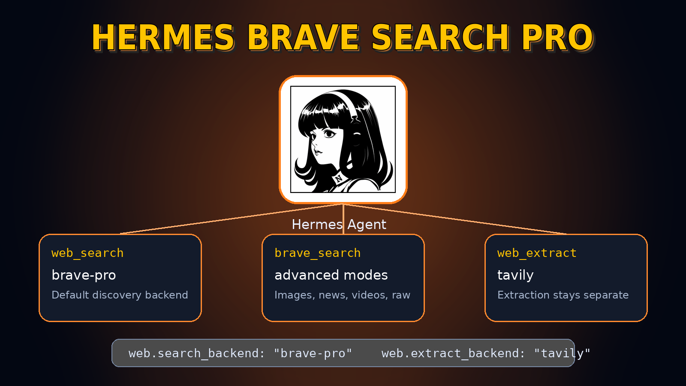
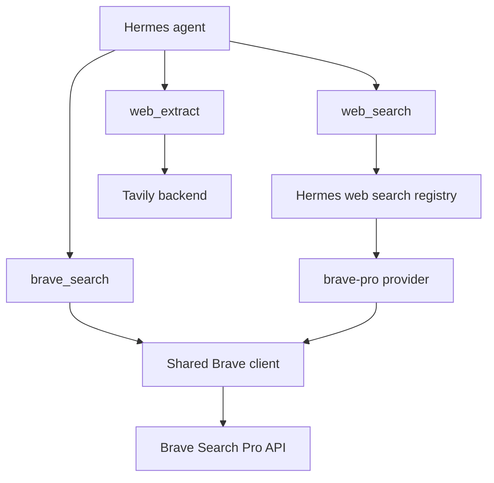

# Brave Search Pro for Hermes Agent

<p align="center">
  
</p>

<p align="center">
  <a href="LICENSE"></a>
  
  
  
</p>

Brave Search Pro as a first-class Hermes Agent plugin.

Use Brave for fast index-backed discovery, keep Tavily doing extraction, and reach for the explicit `brave_search` tool when you need Brave-specific modes like images, news, videos, discussions, suggestions, raw payloads, or web results plus Brave's answer-context payloads.

## Why this exists

Hermes already separates search from extraction. This plugin leans into that design:

- **Discovery:** `web_search` uses Brave Search Pro through the `brave-pro` backend.
- **Extraction:** `web_extract` can stay on Tavily through `web.extract_backend`.
- **Advanced search:** `brave_search` exposes Brave modes that do not fit the standard `web_search` contract.
- **No core patching:** install the plugin, configure Hermes, and keep updating Hermes normally.

## Features

- Hermes web-search provider named `brave-pro`
- Advanced Hermes tool named `brave_search`
- Search-only provider so Tavily remains the extraction backend
- Shared Brave client with structured errors and response normalisation
- Mocked test suite that does not require live Brave credentials
- Public-ready docs, examples, and visual explanation

## Quick start

Canonical Hermes install:

```bash
hermes plugins install GodsBoy/hermes-brave-search-pro --enable
```

Set your Brave credential in the environment Hermes runs with:

```bash
BRAVE_SEARCH_API_KEY=bsa-your-key-here
```

Configure Hermes to use Brave for search and Tavily for extraction:

```yaml
plugins:
  enabled:
    - brave-search

web:
  search_backend: "brave-pro"
  extract_backend: "tavily"
```

That gives you the clean pairing:

```python
web_search(query="Hermes Agent plugins", limit=5)   # Brave Search Pro
web_extract(urls=["https://example.com/article"])  # Tavily
brave_search(query="Hermes Agent", mode="news")   # Brave-specific mode
```

## Advanced `brave_search` modes

`brave_search` accepts:

- `both`: web results plus Brave answer-context payloads where available
- `web`: standard Brave web results
- `llm`: Brave answer-context payloads where available
- `images`: image search
- `news`: news search
- `videos`: video search
- `discussions`: discussion-focused results
- `suggest`: query suggestions
- `raw`: raw Brave API payload for debugging and exploration

Example:

```python
brave_search(query="Hermes Agent plugin system", mode="both", limit=5)
```

## Architecture



The standard Hermes `web_search` tool stays standard. The plugin changes the backend, not the tool contract. Richer Brave modes are explicit, which keeps normal search simple and makes advanced use intentional.

## Repository layout

```text
src/hermes_brave_search/
├── __init__.py     # Hermes registration entry point
├── client.py       # Brave API client and normalisation
├── provider.py     # Hermes web search provider
├── schemas.py      # Tool schema for brave_search
└── tools.py        # Tool handler
```

## Install options

Canonical Hermes install:

```bash
hermes plugins install GodsBoy/hermes-brave-search-pro --enable
```

Direct user-plugin install:

```bash
git clone https://github.com/GodsBoy/hermes-brave-search-pro.git \
  ~/.hermes/plugins/brave-search
hermes plugins enable brave-search
```

Profile-specific install:

```bash
git clone https://github.com/GodsBoy/hermes-brave-search-pro.git \
  ~/.hermes/profiles/myprofile/plugins/brave-search
hermes --profile myprofile plugins enable brave-search
```

From an existing checkout, install a symlink:

```bash
./scripts/install.sh
# Optional profile-aware install
HERMES_PROFILE=myprofile ./scripts/install.sh
```

For development only:

```bash
git clone https://github.com/GodsBoy/hermes-brave-search-pro.git
cd hermes-brave-search-pro
uv venv
uv pip install -e '.[dev]'
uv run pytest
uv run ruff check .
```

The default tests mock Brave HTTP responses. Live API calls are not part of the normal test path, so public contributors do not need Brave API quota.

## Troubleshooting

### Hermes cannot see the provider

Check that the plugin is enabled and Hermes was restarted after installation:

```bash
hermes plugins enable brave-search
```

Then confirm your config uses the provider name exactly:

```yaml
web:
  search_backend: "brave-pro"
```

### Search says the API key is missing

Set `BRAVE_SEARCH_API_KEY` in the environment used by the Hermes process. `BRAVE_API_KEY` is accepted as a compatibility fallback, but `BRAVE_SEARCH_API_KEY` is the documented name.

### Extraction stopped using Tavily

Set extraction explicitly:

```yaml
web:
  search_backend: "brave-pro"
  extract_backend: "tavily"
```

Do not rely on `web.backend` for this pairing because that single fallback applies to both capabilities.

## License

MIT. See [LICENSE](LICENSE).
