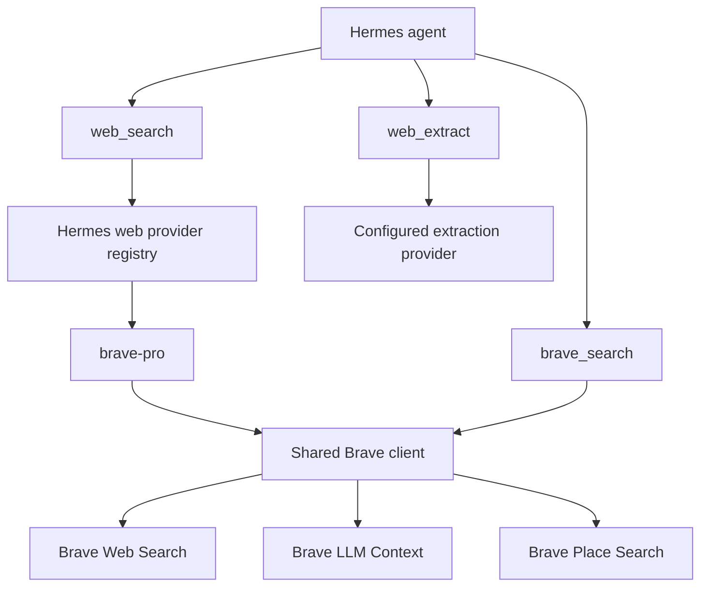

# Brave Search Pro for Hermes Agent

<p align="center">
  
</p>

<p align="center">
  <a href="LICENSE"></a>
  
  
  
</p>

Use Brave Search Pro as the `web_search` backend in [Hermes Agent](https://github.com/NousResearch/hermes-agent). The plugin also adds an explicit `brave_search` tool for Brave's LLM Context API, Place Search, media, news, discussions and raw API responses.

Brave handles discovery. Extraction remains separate, so you can pair it with Hermes' bundled `web-tavily` plugin for `web_extract`.

## Contents

- [Quick start](#quick-start)
- [What the plugin provides](#what-the-plugin-provides)
- [Use it](#use-it)
- [How search and extraction fit together](#how-search-and-extraction-fit-together)
- [Advanced Brave modes](#advanced-brave-modes)
- [Configuration](#configuration)
- [Installation options](#installation-options)
- [Desktop Brave Search](#desktop-brave-search)
- [Troubleshooting](#troubleshooting)
- [Development](#development)
- [References](#references)

## Quick start

Install the backend without enabling it, then grant the required built-in tool override permission:

```bash
hermes plugins install GodsBoy/hermes-brave-search-pro --no-enable
hermes plugins enable brave-search --allow-tool-override
hermes gateway restart
```

The installer prompts for `BRAVE_SEARCH_API_KEY`. If you skipped the prompt, add the key to the environment used by Hermes, commonly `~/.hermes/.env` for a gateway installation:

```bash
BRAVE_SEARCH_API_KEY=bsa-your-key-here
```

Then select Brave Pro explicitly:

```bash
hermes config set web.backend brave-pro
hermes config set web.search_backend brave-pro
hermes gateway restart
```

Verify the installation:

```bash
python3 ~/.hermes/plugins/brave-search/scripts/doctor.py
hermes tools
```

The provider should appear as:

```text
Brave Search Pro [pro] - Brave-backed discovery for Hermes web_search. Pair with Tavily for web_extract.
```

## What the plugin provides

- A Hermes web-search provider named `brave-pro`
- An advanced Hermes tool named `brave_search`
- Brave LLM Context API chunks through `/res/v1/llm/context`
- Brave Place Search, local Explore Mode, POI details and POI descriptions
- Image, news, video, discussion and suggestion search modes
- Bounded retries for transient Brave API failures
- Safe backend defaults that prefer Brave Pro over Brave Free when both use the same API key
- A shared Brave client with structured errors and normalised responses
- An optional Hermes Desktop page

The plugin intentionally overrides Hermes' built-in `brave_search` tool. Hermes therefore requires `--allow-tool-override` when the plugin is enabled.

## Use it

The standard Hermes tools keep their normal contracts:

```python
web_search(query="Hermes Agent plugins", limit=5)   # Brave Search Pro
web_extract(urls=["https://example.com/article"])  # Your configured extract backend
```

Use `brave_search` when you need a Brave-specific capability:

```python
brave_search(query="Hermes Agent", mode="news")
brave_search(query="Hermes Agent", mode="context")
brave_search(query="coffee shops", mode="place", location="Cape Town South Africa")
brave_search(mode="pois", ids=["temporary-poi-id-from-place-result"])
```

## How search and extraction fit together

Hermes configures search and extraction independently:

| Capability | Recommended provider | Config key |
| --- | --- | --- |
| `web_search` | Brave Search Pro | `web.search_backend` |
| `web_extract` | Tavily or another extraction provider | `web.extract_backend` |
| Brave-specific retrieval | `brave_search` tool | Plugin tool |

This plugin does not implement `web_extract`. To use Tavily for extraction:

```bash
hermes plugins enable web-tavily
hermes config set web.extract_backend tavily
hermes gateway restart
```

Add `TAVILY_API_KEY` to the Hermes environment before expecting Tavily-backed extraction to work. Tavily is optional and is not a requirement for Brave search or the Desktop page.

## Advanced Brave modes

| Mode | Purpose |
| --- | --- |
| `both` | Web results plus LLM Context API chunks |
| `web` | Standard Brave web results |
| `llm`, `context` | Dedicated LLM Context API chunks |
| `images`, `news`, `videos` | Media and news search |
| `discussions` | Discussion-focused web results |
| `suggest` | Query suggestions |
| `place`, `local` | Place Search and local Explore Mode |
| `pois` | Follow-up details for temporary POI IDs |
| `descriptions` | Follow-up descriptions for temporary POI IDs |
| `raw` | Raw Brave API payload |

`mode="both"` makes a web-search request and a separate LLM Context request. If the context request fails, web results are still returned with an `llm_context_error` field.

Place Search uses `count` for up to 100 results. `pois` and `descriptions` accept temporary POI IDs returned by Place Search; Brave says those IDs expire after approximately eight hours.

See [Advanced modes](docs/installation.md#advanced-modes) for context budgets, locale controls, Goggles, local recall, coordinates, POI options and complete examples.

## Configuration

The plugin applies conservative defaults when it loads:

- Missing search settings, or settings still using `brave-free`, move to `brave-pro` when Brave is credentialed.
- `web.extract_backend` moves to `tavily` only when Tavily is credentialed and no extraction backend is selected.
- The bundled `web-tavily` plugin must still be enabled for Tavily extraction.

Explicit configuration:

```yaml
plugins:
  enabled:
    - brave-search
    - web-tavily  # optional
  entries:
    brave-search:
      allow_tool_override: true

web:
  backend: "brave-pro"
  search_backend: "brave-pro"
  extract_backend: "tavily"
```

Equivalent commands:

```bash
hermes config set web.backend brave-pro
hermes config set web.search_backend brave-pro
hermes plugins enable web-tavily  # optional
hermes config set web.extract_backend tavily
```

## Installation options

### Update an existing installation

```bash
hermes plugins update brave-search
hermes gateway restart
```

### Direct user-plugin installation

```bash
git clone https://github.com/GodsBoy/hermes-brave-search-pro.git \
  ~/.hermes/plugins/brave-search
hermes plugins enable brave-search --allow-tool-override
hermes gateway restart
```

### Named profile

```bash
git clone https://github.com/GodsBoy/hermes-brave-search-pro.git \
  ~/.hermes/profiles/myprofile/plugins/brave-search
hermes --profile myprofile plugins enable brave-search --allow-tool-override
hermes --profile myprofile gateway restart
python3 ~/.hermes/profiles/myprofile/plugins/brave-search/scripts/doctor.py
```

### Existing development checkout

```bash
./scripts/install.sh
hermes plugins enable brave-search --allow-tool-override
hermes gateway restart
```

Use `HERMES_PROFILE=myprofile ./scripts/install.sh` for a named profile. The helper installs profile-scoped backend and Desktop symlinks and refuses to replace conflicting paths.

See [Installation](docs/installation.md) for the full profile, credential and remote-backend guide.

## Desktop Brave Search

The Desktop page is optional and disabled by default. Install the backend first, then install the renderer for the selected local profile:

Desktop files live at `desktop-plugins/brave-search`. The Python backend lives separately at `plugins/brave-search`.

```bash
~/.hermes/plugins/brave-search/scripts/install-desktop.sh
```

For a named local profile:

```bash
HERMES_PROFILE=myprofile \
  ~/.hermes/profiles/myprofile/plugins/brave-search/scripts/install-desktop.sh
```

Enable **Brave Search** in Hermes Desktop Settings after installation. The Desktop toggle controls only the renderer and does not require a gateway restart. Loading a Desktop plugin does not automatically import the Python plugin into the gateway. The Python backend remains a separate plugin in the active gateway profile.

### Remote backend with local Desktop

When Desktop connects to a remote gateway, keep a persistent renderer checkout on the Desktop machine:

```bash
git clone https://github.com/GodsBoy/hermes-brave-search-pro.git \
  ~/hermes-brave-search-desktop
~/hermes-brave-search-desktop/scripts/install-desktop.sh

HERMES_PROFILE=myprofile \
  ~/hermes-brave-search-desktop/scripts/install-desktop.sh
```

Keep this checkout in place because the installer links the selected Desktop profile to its `desktop/` directory. The Desktop-only installer leaves `plugins/brave-search` untouched and does not create a local backend link. Deploy and enable the Python backend separately on the remote active profile. Installing the renderer does not copy, enable or configure the backend.

Brave Desktop search requires only `BRAVE_SEARCH_API_KEY`. Tavily remains optional and separate. See [Remote backend with local Desktop](docs/installation.md#remote-backend-with-local-desktop) for the complete profile and gateway notes.

## Troubleshooting

Run the doctor after changing credentials or provider settings:

```bash
python3 ~/.hermes/plugins/brave-search/scripts/doctor.py
python3 ~/.hermes/plugins/brave-search/scripts/doctor.py --fix
```

If `python3` is unavailable, use the exact interpreter printed by `./scripts/install.sh`, or another compatible Python 3.11 to 3.13 interpreter.

Use `--force` only when you intend to replace existing web-provider choices:

```bash
python3 ~/.hermes/plugins/brave-search/scripts/doctor.py --fix --force
```

The doctor checks:

- Brave and Tavily credentials
- Plugin enablement and tool override permission
- `web.backend`, `web.search_backend` and `web.extract_backend`
- The optional `web-tavily` pairing

Common fixes:

```bash
hermes plugins enable brave-search --allow-tool-override
hermes plugins enable web-tavily  # only when using Tavily extraction
hermes config set web.backend brave-pro
hermes config set web.search_backend brave-pro
hermes config set web.extract_backend tavily
hermes gateway restart
```

`BRAVE_API_KEY` is accepted as a compatibility fallback, but `BRAVE_SEARCH_API_KEY` is the documented variable.

## Architecture


```mermaid
flowchart TB
  Agent[Hermes agent] --> Search[web_search]
  Agent --> Advanced[brave_search]
  Search --> Registry[Hermes web provider registry]
  Registry --> Provider[brave-pro]
  Provider --> Client[Shared Brave client]
  Advanced --> Client
  Client --> Web[Brave Web Search]
  Client --> Context[Brave LLM Context]
  Client --> Place[Brave Place Search]
  Agent --> Extract[web_extract]
  Extract --> ExtractProvider[Configured extraction provider]
```

The standard `web_search` tool keeps the Hermes response contract. The plugin changes the provider behind it. Brave-specific parameters stay on the explicit `brave_search` tool.

## Development

```bash
git clone https://github.com/GodsBoy/hermes-brave-search-pro.git
cd hermes-brave-search-pro
uv venv
uv pip install -e '.[dev]'
uv run ruff check .
uv run pytest
```

Tests use mocked Brave responses, so contributors do not need Brave API quota.

## References

- [Hermes plugin guide](https://hermes-agent.nousresearch.com/docs/developer-guide/plugins)
- [Hermes web-search provider guide](https://hermes-agent.nousresearch.com/docs/developer-guide/web-search-provider-plugin)
- [Brave LLM Context API](https://api-dashboard.search.brave.com/documentation/services/llm-context)
- [Brave Place Search API](https://api-dashboard.search.brave.com/documentation/services/place-search)
- [Brave Search API](https://brave.com/search/api/)

## License

MIT. See [LICENSE](LICENSE).
